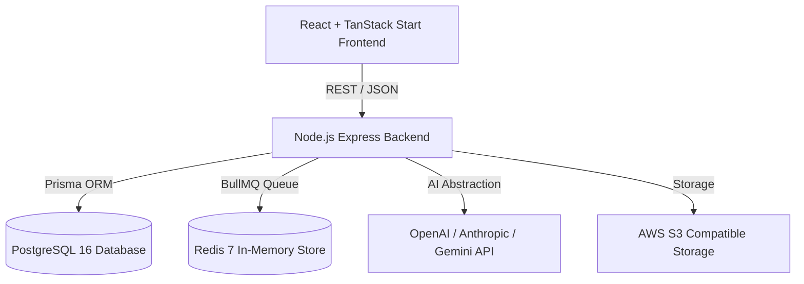

# TalentOS System Architecture & Enterprise Specifications

## Overview
TalentOS is an enterprise-grade AI Recruitment Platform built with a Clean Architecture paradigm.



## Core Modules & Service Components

### 1. Database Layer (PostgreSQL & Prisma)
- Full relational schema enforcing tenant separation (`organizationId`).
- Soft-delete strategy on core models (`isDeleted`).
- Versioning support for candidates and resumes.

### 2. Multi-Model AI Abstraction Service
- Provider-independent routing logic supporting OpenAI, Anthropic Claude, and Google Gemini.
- Deterministic local fallbacks for development without API keys.
- Structured outputs for Resume Parsing, Explainable Candidate Matcher, JD Generator, and AI Recruiter Assistant.

### 3. Background Processing & Queues
- BullMQ and Redis handling asynchronous resume parsing, candidate scoring backfills, email notifications, and analytics batching.

### 4. Security & Compliance
- JWT access tokens stored in HTTP-Only cookies + Refresh token rotation.
- Fine-grained Role-Based Access Control (RBAC) supporting Super Admin, Admin, Recruiter, Hiring Manager, Interviewer.
- Comprehensive Audit Log tracking all entity mutations.

---

## Deployment & Single Command Execution

To start the full platform using Docker Compose:

```bash
docker-compose up --build
```

Services exposed:
- **Web Frontend**: `http://localhost:3000`
- **Backend API**: `http://localhost:4000/api/v1`
- **PostgreSQL**: `localhost:5432`
- **Redis**: `localhost:6379`
